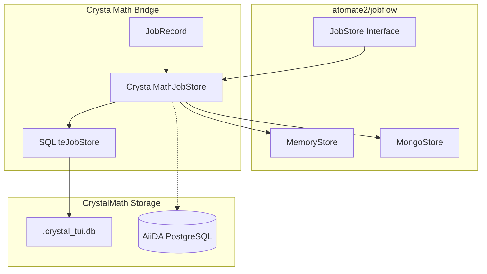

# atomate2 Integration Design

**Version:** 1.0.0
**Status:** Design Complete (Phase 2.2)
**Date:** 2026-01-09
**Author:** Architect Agent (Task 2.2)

---

## Executive Summary

This document defines the integration layer between CrystalMath and atomate2, enabling:

1. **atomate2 Flow Access** - Use atomate2's extensive Maker library (RelaxFlowMaker, BandStructureFlowMaker, etc.) through CrystalMath's unified API
2. **Storage Bridge** - Seamless data flow between atomate2's JobStore and CrystalMath's SQLite/.crystal_tui.db
3. **Multi-code Workflows** - Orchestrate complex workflows spanning multiple DFT codes (VASP -> YAMBO, QE -> BerkeleyGW)

The integration maintains full compatibility with CrystalMath's Protocol interfaces while leveraging atomate2's battle-tested workflow implementations.

---

## Table of Contents

1. [Architecture Overview](#architecture-overview)
2. [Flow Mapping](#flow-mapping)
3. [JobStore Bridge](#jobstore-bridge)
4. [Multi-Code Workflows](#multi-code-workflows)
5. [Implementation Details](#implementation-details)
6. [Error Handling](#error-handling)
7. [Phase 3 Roadmap](#phase-3-roadmap)

---

## Architecture Overview

### Integration Layers

```
+==============================================================================+
|                         CrystalMath High-Level API                            |
|  +------------------------------------------------------------------------+  |
|  |  CrystalWorkflow  |  VASPWorkflow  |  HybridWorkflow                   |  |
|  +------------------------------------------------------------------------+  |
+==============================================================================+
                                    |
                                    v
+==============================================================================+
|                      CrystalMath Protocol Layer                               |
|  +------------------------------------------------------------------------+  |
|  |  WorkflowRunner  |  StructureProvider  |  Backend  |  ResultsCollector |  |
|  +------------------------------------------------------------------------+  |
+==============================================================================+
                                    |
        +---------------------------+---------------------------+
        |                           |                           |
        v                           v                           v
+------------------+       +------------------+       +------------------+
|   AiiDARunner    |       |  JobflowRunner   |       |   LocalRunner    |
| (Full Provenance)|       | (atomate2 bridge)|       | (Development)    |
+------------------+       +------------------+       +------------------+
        |                           |
        v                           v
+------------------+       +------------------+
| AiiDA WorkChains |       |   atomate2       |
| (existing code)  |       |   Integration    |
+------------------+       +------------------+
                                    |
        +---------------------------+---------------------------+
        |                           |                           |
        v                           v                           v
+------------------+       +------------------+       +------------------+
| FlowMakerRegistry|       | Atomate2Bridge   |       | MultiCodeFlow    |
| (maker lookup)   |       | (adapter layer)  |       | Builder          |
+------------------+       +------------------+       +------------------+
                                    |
                                    v
+==============================================================================+
|                         JobStore Bridge Layer                                 |
|  +------------------------------------------------------------------------+  |
|  |  CrystalMathJobStore  |  SQLiteJobStore  |  JobStoreBridge             |  |
|  +------------------------------------------------------------------------+  |
+==============================================================================+
                                    |
        +---------------------------+---------------------------+
        |                           |                           |
        v                           v                           v
+------------------+       +------------------+       +------------------+
|  .crystal_tui.db |       |     MongoDB      |       |   MemoryStore    |
|    (SQLite)      |       | (Production HT)  |       |   (Testing)      |
+------------------+       +------------------+       +------------------+
```

### Key Design Decisions

1. **Protocol Compliance** - All integration classes implement CrystalMath Protocol interfaces
2. **Lazy Imports** - atomate2 is imported only when used, not at package load time
3. **Bidirectional Sync** - Jobs visible in both atomate2 and CrystalMath interfaces
4. **Backward Compatibility** - Existing CrystalMath workflows continue to work unchanged

---

## Flow Mapping

### atomate2 Flows to CrystalMath WorkflowTypes

| CrystalMath WorkflowType | atomate2 Maker | Notes |
|--------------------------|----------------|-------|
| `WorkflowType.RELAX` | `DoubleRelaxMaker` | Two-step relaxation (volume + positions) |
| `WorkflowType.SCF` | `StaticMaker` | Single-point energy calculation |
| `WorkflowType.BANDS` | `BandStructureMaker` | Band structure along high-symmetry path |
| `WorkflowType.DOS` | `StaticMaker` + DOS | Static calculation with DOS output |
| `WorkflowType.ELASTIC` | `ElasticMaker` | Full elastic tensor via strain |
| `WorkflowType.PHONON` | `PhononMaker` | Phonon dispersion via finite differences |
| `WorkflowType.EOS` | `EOSMaker` | Equation of state via volume deformation |
| `WorkflowType.RELAX_BANDS` | `RelaxBandStructureMaker` | Combined relax + bands |
| `WorkflowType.GW` | Custom (MultiCodeFlowBuilder) | VASP/QE -> YAMBO |
| `WorkflowType.BSE` | Custom (MultiCodeFlowBuilder) | Full GW+BSE pipeline |

### FlowMakerRegistry

The `FlowMakerRegistry` class handles the mapping between CrystalMath WorkflowTypes and atomate2 Makers:

```python
from crystalmath.integrations import Atomate2Bridge
from crystalmath.protocols import WorkflowType

# Direct usage
bridge = Atomate2Bridge()
maker = bridge._registry.get_maker(
    workflow_type=WorkflowType.RELAX,
    code="vasp",
    protocol=ProtocolLevel.MODERATE,
)
flow = maker.make(structure)

# Or via high-level API
result = bridge.submit(
    workflow_type=WorkflowType.RELAX,
    structure=structure,
    code="vasp",
)
```

### Protocol Levels

atomate2 uses protocol-based configuration. CrystalMath maps these to `ProtocolLevel`:

| ProtocolLevel | Description | Use Case |
|---------------|-------------|----------|
| `FAST` | Minimal accuracy, quick results | Screening, testing |
| `MODERATE` | Balanced accuracy/cost | Standard production |
| `PRECISE` | High accuracy, expensive | Publication-quality |
| `CONVERGENCE_TEST` | Parameter sweep | Convergence studies |
| `PRODUCTION` | HPC-optimized settings | Large-scale runs |
| `DEBUG` | Minimal settings | Development |

---

## JobStore Bridge

### Storage Architecture



### CrystalMathJobStore

The main integration store supporting multiple backends:

```python
from crystalmath.integrations import CrystalMathJobStore
from jobflow import run_locally

# Create store backed by CrystalMath's SQLite database
store = CrystalMathJobStore.from_crystalmath_db()

# Use with jobflow
responses = run_locally(flow, store=store)

# Jobs now visible in CrystalMath's job tracking
jobs = store.query_jobs(state="completed")
for job in jobs:
    print(f"Job {job.uuid}: {job.name} -> {job.state}")
```

### Bidirectional Sync

The bridge maintains consistency between atomate2 and CrystalMath:

| Direction | Method | When Used |
|-----------|--------|-----------|
| atomate2 -> CrystalMath | `sync_to_crystalmath()` | After Flow completion |
| CrystalMath -> atomate2 | `sync_from_crystalmath()` | Import existing jobs |
| Automatic | On `update()` | When `sync_enabled=True` |

### JobRecord

Unified job representation for bridge operations:

```python
@dataclass
class JobRecord:
    uuid: str                          # atomate2 UUID
    pk: Optional[int]                  # CrystalMath PK
    name: str                          # Job name
    state: str                         # Current state
    inputs: Dict[str, Any]             # Job inputs
    outputs: Dict[str, Any]            # Job outputs
    metadata: Dict[str, Any]           # Additional data

    def to_jobflow_dict(self) -> Dict[str, Any]: ...
    def to_crystalmath_status(self) -> JobStatus: ...
```

---

## Multi-Code Workflows

### Overview

Multi-code workflows chain calculations across different DFT codes. Common patterns:

| Workflow | Code Chain | Purpose |
|----------|------------|---------|
| GW Corrections | VASP SCF -> YAMBO GW | Quasiparticle energies |
| Optical (BSE) | VASP SCF -> YAMBO GW -> YAMBO BSE | Excitons, absorption |
| Wannier Interpolation | VASP SCF -> Wannier90 | MLWFs, transport |
| Phonon Transport | VASP SCF -> Phonopy -> BoltzTraP | Thermal conductivity |

### Existing AiiDA Implementation

CrystalMath already has multi-code workflows in `tui/src/aiida/workchains/multicode/`:

- `MultiCodeWorkChain` - Base class for orchestration
- `PostSCFWorkChain` - SCF + post-processing pattern
- `YamboGWWorkChain` - CRYSTAL23 -> YAMBO GW
- `YamboBSEWorkChain` - Full GW+BSE pipeline
- `converters.py` - Data format converters

### atomate2 Integration Approach

For atomate2-based multi-code workflows, we use `MultiCodeFlowBuilder`:

```python
from crystalmath.integrations import MultiCodeFlowBuilder
from crystalmath.protocols import WorkflowType

builder = MultiCodeFlowBuilder()

# Define workflow steps
flow = (
    builder
    .add_step("relax", "vasp", WorkflowType.RELAX)
    .add_step("scf", "vasp", WorkflowType.SCF, depends_on=["relax"])
    .add_handoff("scf", "gw", converter=vasp_to_yambo_converter)
    .add_step("gw", "yambo", WorkflowType.GW, depends_on=["scf"])
    .build(structure)
)
```

### Code Handoffs

The `CodeHandoff` class defines data transfer between codes:

```python
@dataclass
class CodeHandoff:
    source_code: str           # e.g., "vasp"
    target_code: str           # e.g., "yambo"
    output_key: str            # Key in source outputs
    input_key: str             # Key in target inputs
    converter: Callable        # Optional data transformer
    validation: Callable       # Optional validator
```

### Converter Functions

Converters handle format translation (from `multicode/converters.py`):

| Converter | Source | Target | Data |
|-----------|--------|--------|------|
| `crystal_to_qe_wavefunction` | CRYSTAL23 | QE/YAMBO | Wavefunction |
| `crystal_to_yambo_input` | CRYSTAL23 | YAMBO | GW parameters |
| `crystal_to_berkeleygw` | CRYSTAL23 | BerkeleyGW | GW parameters |
| `crystal_bands_to_wannier90` | CRYSTAL23 | Wannier90 | Band structure |
| `extract_band_edges` | Any | Any | VBM/CBM info |

### Error Handling Across Code Boundaries

Multi-code workflows have special error handling needs:

```python
class MultiCodeFlowBuilder:
    def build(self, structure) -> Flow:
        # Validate all steps before building
        is_valid, issues = self.validate()
        if not is_valid:
            raise FlowExecutionError(f"Invalid workflow: {issues}")

        # Each step wraps execution with error context
        for step in self._steps:
            job = self._create_job(step)
            job.config.on_missing_references = "error"
            # Propagate source code context in errors
```

---

## Implementation Details

### Module Structure

```
python/crystalmath/integrations/
├── __init__.py              # Package init with lazy imports
├── atomate2_bridge.py       # Main integration classes
│   ├── FlowMakerRegistry    # Maker lookup
│   ├── Atomate2FlowAdapter  # Flow wrapper
│   ├── Atomate2Bridge       # Main entry point
│   └── MultiCodeFlowBuilder # Multi-code workflows
└── jobflow_store.py         # Storage integration
    ├── JobStoreBridge       # Abstract bridge
    ├── SQLiteJobStore       # SQLite backend
    └── CrystalMathJobStore  # Main store
```

### Class Hierarchy

```
Protocol: WorkflowRunner
    ↓
Atomate2Bridge (implements WorkflowRunner-like interface)
    ├── FlowMakerRegistry (Maker lookup)
    ├── Atomate2FlowAdapter (Flow wrapper)
    └── MultiCodeFlowBuilder (multi-code support)

Protocol: Store (Maggma)
    ↓
CrystalMathJobStore (implements Store)
    ├── SQLiteJobStore (SQLite backend)
    └── MongoStore (MongoDB backend, optional)
```

### Type Safety

Full type hints throughout:

```python
def submit(
    self,
    workflow_type: WorkflowType,
    structure: Any,  # Union[Structure, StructureData, str, Path, dict]
    code: str = "vasp",
    parameters: Optional[Dict[str, Any]] = None,
    resources: Optional[ResourceRequirements] = None,
    protocol: ProtocolLevel = ProtocolLevel.MODERATE,
    **kwargs: Any,
) -> WorkflowResult:
    ...
```

### Lazy Imports

atomate2 is not required at package import:

```python
# In __init__.py
def __getattr__(name: str):
    if name == "Atomate2Bridge":
        from crystalmath.integrations.atomate2_bridge import Atomate2Bridge
        return Atomate2Bridge
    raise AttributeError(...)

# In atomate2_bridge.py
def _import_maker(self, workflow_type: str, code: str) -> Type[Maker]:
    module = importlib.import_module(module_path)
    return getattr(module, class_name)
```

---

## Error Handling

### Exception Hierarchy

```python
class Atomate2IntegrationError(Exception):
    """Base exception for atomate2 integration errors."""

class MakerNotFoundError(Atomate2IntegrationError):
    """No Maker registered for workflow type + code combination."""

class FlowExecutionError(Atomate2IntegrationError):
    """Flow execution failed."""

class CodeHandoffError(Atomate2IntegrationError):
    """Data transfer between codes failed."""
```

### Error Propagation

```python
def submit(self, workflow_type, structure, code, ...):
    try:
        maker = self._registry.get_maker(workflow_type, code, protocol)
    except MakerNotFoundError as e:
        return WorkflowResult(
            success=False,
            errors=[str(e)],
            metadata={"error_type": "maker_not_found"},
        )

    try:
        flow = maker.make(pmg_structure)
    except Exception as e:
        return WorkflowResult(
            success=False,
            errors=[f"Failed to create Flow: {e}"],
            metadata={"error_type": "flow_creation_failed"},
        )
    ...
```

### Recovery Strategies

Multi-code workflows support recovery:

| Strategy | Description | Use Case |
|----------|-------------|----------|
| `RETRY` | Re-run failed step | Transient failures |
| `CHECKPOINT` | Restart from last checkpoint | Long workflows |
| `SKIP` | Skip failed step, continue | Non-critical steps |
| `FAIL_FAST` | Stop immediately | Critical failures |

---

## Phase 3 Roadmap

### Stub Implementations to Complete

The following methods are currently stubs and will be implemented in Phase 3:

#### atomate2_bridge.py

| Method | Priority | Complexity |
|--------|----------|------------|
| `Atomate2FlowAdapter.run_and_collect()` | High | Medium |
| `Atomate2Bridge.submit_composite()` | High | High |
| `MultiCodeFlowBuilder.build()` | High | High |
| `create_vasp_to_yambo_flow()` | Medium | Medium |

#### jobflow_store.py

| Method | Priority | Complexity |
|--------|----------|------------|
| `SQLiteJobStore.connect()` | High | Low |
| `SQLiteJobStore.query()` | High | Medium |
| `SQLiteJobStore.update()` | High | Medium |
| `CrystalMathJobStore.sync_to_crystalmath()` | Medium | Medium |
| `CrystalMathJobStore.sync_from_crystalmath()` | Medium | Medium |
| `CrystalMathJobStore.from_mongo()` | Low | Low |
| `CrystalMathJobStore.import_from_aiida()` | Low | High |

### Dependencies for Phase 3

```python
# Required
atomate2>=0.0.21
jobflow>=0.1.17
pymatgen>=2024.1.1

# Optional
maggma>=0.66.0      # For MongoStore
fireworks>=2.0.0    # For FireWorks backend
jobflow-remote>=0.1 # For HPC submission
```

### Testing Plan

1. **Unit Tests** - Mock atomate2 Makers, test adapters
2. **Integration Tests** - Real VASP calculations on beefcake2
3. **Multi-code Tests** - VASP -> YAMBO pipeline
4. **Performance Tests** - Benchmark sync operations

---

## References

1. atomate2 Documentation: https://materialsproject.github.io/atomate2/
2. jobflow Documentation: https://materialsproject.github.io/jobflow/
3. Maggma Documentation: https://materialsproject.github.io/maggma/
4. CrystalMath Unified Architecture: `docs/architecture/UNIFIED-WORKFLOW-ARCHITECTURE.md`
5. Existing Multi-code WorkChains: `tui/src/aiida/workchains/multicode/`

---

## Appendix: File Locations

| File | Purpose |
|------|---------|
| `python/crystalmath/integrations/__init__.py` | Package init with lazy imports |
| `python/crystalmath/integrations/atomate2_bridge.py` | Main integration classes |
| `python/crystalmath/integrations/jobflow_store.py` | Storage bridge |
| `python/crystalmath/protocols.py` | Protocol definitions |
| `tui/src/aiida/workchains/multicode/` | Existing AiiDA multi-code workflows |
| `docs/architecture/ATOMATE2-INTEGRATION.md` | This document |
