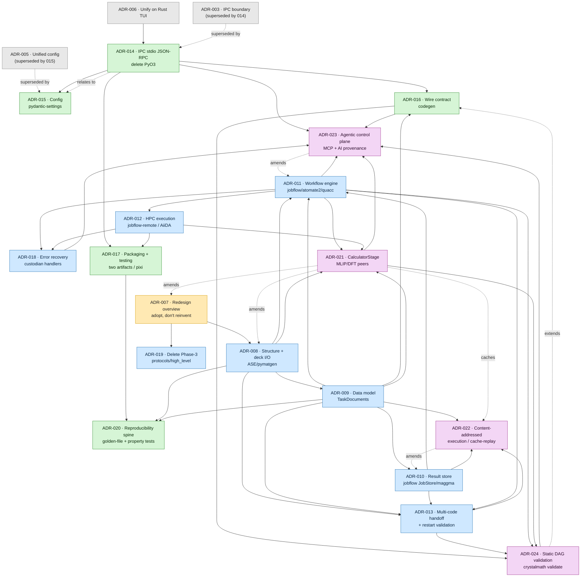

# CrystalMath Redesign — Master Index (ADR-007 … ADR-024)

**Status:** Proposed (the whole set)
**Date:** 2026-06-03
**Governing ADR:** [ADR-007 — Redesign Overview](adr-007-redesign-overview-adopt-ecosystem.md)

This document is the single entry point to the free-rein redesign captured in ADR-007 through
ADR-024. It states the north-star vision, lists every redesign ADR with its status and
supersession, gives a dependency-ordered reading path, and narrates how the pieces fit. The
normative content lives in the ADRs themselves; this index is a map, not a decision.

ADR-007–020 are the original spine; **ADR-021–024 add a SOTA / autonomous-workflow layer** that
re-centers the calculation seam on a code-agnostic `CalculatorStage` (DFT and MLIP/foundation
calculators as peers), makes content-addressed execution a first-class enforced gate, adds an
agentic control plane, and proves the whole DAG well-typed before submission. ADR-007 is amended to
govern 008–024; ADR-008/009/010/011/012/013/020 carry `Amendment (2026-06-03)` sections recorded in
the [Amendments log](#amendments-log) below.

---

## North-Star Vision

CrystalMath should stop being a half-built clone of the Materials-Project stack and become a thin,
opinionated **conductor** on top of it. The research is unanimous on one point: every subsystem
CrystalMath hand-rolls — a sequential step executor, a bespoke ADAPTIVE error-recovery enum, a flat
job-row SQLite schema, an inline `sbatch` string-builder, two DFT-code abstractions, two JSON-RPC
registries, a fork-by-copy `_vendor` tree — is a worse reimplementation of something the ecosystem
already does robustly: **jobflow/atomate2** for the dynamic DAG, **custodian** for error recovery,
**AiiDA/maggma** for provenance + store, **jobflow-remote/PSI-J/QToolKit** for HPC scheduling,
**pymatgen.io.core + ASE** for input/output, and the **LSP/MCP** JSON-RPC pattern for the UI
boundary.

With **zero current users** and an explicit mandate for bold redesign, the north star is: delete the
homegrown machinery, adopt jobflow as the single workflow IR, persist through one provenance-aware
Store, drive HPC through a pluggable scheduler/transport seam, and let CrystalMath's *actual*
differentiators — the **Rust/Ratatui TUI**, the **multi-code physics knowledge** (especially
CRYSTAL23 and YAMBO, which the ecosystem does **not** cover), and the **one-liner ergonomics** — be
the only code we truly own and maintain.

The result is a system whose every load-bearing component is either (a) a mature,
community-maintained ecosystem tool, or (b) genuinely novel code that only CrystalMath has a reason
to write. Reproducibility is **structural, not aspirational**: provenance is recorded by the engine
on every transition, environments are pinned, inputs are golden-file regression-tested and
content-addressed, and the JSON-RPC protocol is versioned. CrystalMath becomes small, testable, and
FAIR — a TUI and a physics-aware orchestration shim over the best of the materials ecosystem, not a
parallel universe of it.

### The one rule

ADR-007 reduces the whole redesign to a single rule it then sequences:

> **Replace every "N co-equal implementations behind a thin facade, with availability-detection at
> runtime" with *one default* grounded in a mature ecosystem tool — the rest demoted to a genuinely
> optional plugin behind one stable seam, or deleted.**

The audit found that exact shape in seven places: ≥5 runner hierarchies, 3 SLURM-over-SSH stacks, 2
dispatch registries, 2 live transports (PyO3 + IPC), 4 per-code deck seams, 3 result stores, and a
`_vendor/` fork-copy of the deprecated Textual TUI. Each facade *defers* a decision; the cumulative
cost is a `{storage} × {engine} × {transport}` test matrix riddled with `ImportError`-gated silent
no-ops. The redesign makes the decision.

---

## The Canonical Redesign ADR Set

| ADR | Title (short) | Status | Supersedes | Depends on |
|-----|---------------|--------|------------|------------|
| [007](adr-007-redesign-overview-adopt-ecosystem.md) | Redesign overview — adopt the ecosystem, collapse N-way facades to one | Proposed | none | none (governs 008–024; amended 2026-06-03 for the SOTA layer) |
| [008](adr-008-structure-and-deck-io-on-ase-pymatgen.md) | Structure + deck I/O on pymatgen + ASE; `CodeDeckGenerator` becomes a thin adapter | Proposed | none | 007 |
| [009](adr-009-canonical-data-model-emmet-pydantic-taskdocs.md) | Canonical result schema — emmet-style versioned pydantic `TaskDocument`s + provenance fields | Proposed | none | 008 |
| [010](adr-010-single-result-store-jobflow-maggma.md) | One canonical result store — jobflow `JobStore` over maggma | Proposed | none | 009 |
| [011](adr-011-workflow-engine-jobflow-atomate2-quacc.md) | Workflow engine — jobflow `Flow`s (atomate2/quacc recipes) as the one orchestration model | Proposed | none | 010, 009, 008 |
| [012](adr-012-hpc-execution-jobflow-remote-aiida-optional.md) | HPC execution — jobflow-remote (outbound-SSH daemon) default, AiiDA opt-in; delete bespoke SLURM/SSH | Proposed | none | 011 |
| [013](adr-013-multi-code-handoff-and-restart-validation.md) | Multi-code handoff — typed document edges + mandatory restart-file validation | Proposed | none | 009, 010, 011, 008 |
| [014](adr-014-ipc-boundary-stdio-jsonrpc-delete-pyo3.md) | Rust↔Python boundary — JSON-RPC over spawned-child stdio (LSP/MCP); delete PyO3, unify dispatch | Proposed | **003** | 006; relates to 015 |
| [015](adr-015-unified-config-pydantic-settings.md) | Unified configuration — pydantic-settings as the single resolver | Proposed | **005** | 014 |
| [016](adr-016-wire-contract-codegen-no-drift.md) | Wire contract — pydantic models as source of truth, generate Rust serde types (no drift) | Proposed | none | 014, 009 |
| [017](adr-017-packaging-testing-two-artifacts-pixi.md) | Packaging & testing — two decoupled artifacts, pixi for HPC, extras-matrix CI | Proposed | none | 014, 012 |
| [018](adr-018-error-recovery-custodian-handlers.md) | Error recovery — custodian-style per-code handlers; delete the bespoke ADAPTIVE recovery | Proposed | none | 011, 012 (relates to 013) |
| [019](adr-019-delete-phase3-protocols-aspiration-layer.md) | Delete the unimplemented `protocols.py`/`high_level` "Phase 3" aspiration layer; keep the type aliases | Proposed | none | 007 (relates to 011) |
| [020](adr-020-reproducibility-and-golden-file-testing.md) | Reproducibility spine — golden-file + property/metamorphic tests, real-DFT parser fixtures (extends 017's testing) | Proposed | none | 008, 009, 017 |

**SOTA / autonomous-workflow layer (added 2026-06-03):**

| ADR | Title (short) | Status | Supersedes | Depends on |
|-----|---------------|--------|------------|------------|
| [021](adr-021-calculatorstage-mlip-foundation-calculators.md) | Generalize the calculation layer to `CalculatorStage`; MLIP/foundation calculators as first-class peers of DFT (DFT is one instance) | Proposed | none (amends 008/009/011/012/013/020) | 008, 009, 011, 012 |
| [022](adr-022-content-addressed-execution-cache-replay.md) | Content-addressed execution identity, hash-hit cache-and-clone as the default gate, two-tier caching-vs-replay contract | Proposed | none (enforces/generalizes 009 `input_hash`, 013 checksum; amends 010) | 009, 010, 013 |
| [023](adr-023-agentic-control-plane-mcp-ai-provenance.md) | Agentic/LLM control plane — guarded MCP tool-server above jobflow, generative `CandidateSource`, first-class AI provenance | Proposed | none (amends 011 static-factory framing, 019 "single answer") | 011, 014, 016, 018, 021, 024 |
| [024](adr-024-static-typed-workflow-dag-validation.md) | Static typed workflow/DAG validation — `crystalmath validate` type-checks the whole multi-code DAG offline before any submission | Proposed | none (extends 016 inward to the scientific DAG) | 016, 013, 011, 021 |

**Supersession relationships to the pre-redesign ADRs (001–006):**

- ADR-007 supersedes nothing; it is the umbrella that *governs* 008–024 and is consistent with the
  ADR-006 direction (single Rust TUI over IPC, Python core as source of truth). Its 2026-06-03
  amendment widens the frozen five-code taxonomy to a **code-class** taxonomy (DFT/file-codes +
  phonopy + MLIP/foundation as a peer class) and adds four load-bearing layers (021–024).
- **ADR-014 supersedes [ADR-003](adr-003-ipc-boundary-design.md)** — it keeps ADR-003's JSON-RPC
  decision but changes the transport from a UDS *listener* to a spawned-child *stdio* stream and
  fixes ADR-003's two named bugs (the `/tmp` socket-path divergence and the auto-start race).
- **ADR-015 supersedes [ADR-005](adr-005-unified-configuration.md)** — it adopts ADR-005's *intent*
  (unified TOML, documented precedence, per-code sections, no hardcoded paths) but replaces its
  hand-rolled dataclass/`tomllib` mechanism with pydantic-settings.
- ADR-006 (unify on Rust TUI) remains **Accepted** and is the *direct upstream* of ADR-014 (it named
  the PyO3→IPC cutover as its keystone follow-up) and the philosophical parent of the whole set.
- [ADR-004](adr-004-editor-lsp-strategy.md) (editor/LSP strategy) is untouched by the redesign.

> The redesign ADRs are all **Proposed**. By house convention the supersession of ADR-003/005 takes
> effect on *acceptance*: their `Status` headers should flip to "Superseded by ADR-014 / ADR-015"
> only when 014/015 are accepted (as ADR-001/002 were flipped to "Superseded by ADR-006"). Until
> then ADR-003 reads "Accepted (Implemented)" and ADR-005 "Proposed" — this is intended, not drift.

---

## Dependency Graph & Reading Order

The set forms an acyclic spine. There are two independently-shippable sub-chains plus the
overview that governs both. Edges point from a prerequisite to the ADR that depends on it; dotted
edges are supersession / "relates-to" annotations, not dependency edges.



The same graph as an ASCII sketch:

```
                        ┌──────────────────────────────────────────────┐
                        │ 007  Redesign Overview (the rule + sequencing)│
                        └───────────────────┬──────────────────────────┘
        SCIENTIFIC SPINE  ◄─────────────────┼─────────────────►  INTEROP / PLATFORM SPINE
                                            │
   008 Structure + deck I/O (pymatgen/ASE)  │            006 Unify on Rust TUI (Accepted)
        │                                   │                 │
   009 Result schema (TaskDocuments) ◄──────┘            014 IPC: stdio JSON-RPC, delete PyO3
        │            (008 feeds the parsers)             (supersedes 003)
   010 Result store (jobflow JobStore/maggma)                 │        ╲
        │                                                     │         ╲ relates to
   011 Workflow engine (jobflow Flows) ──── needs 008,009,010 │     015 Unified config (pydantic-settings)
        │                                                     │         (supersedes 005; depends on 014)
   012 HPC execution (jobflow-remote / AiiDA opt-in)          │
        │                                                016 Wire contract (codegen; needs 014 + 009)
   013 Multi-code handoff (typed edges; needs 008,009,010,011)│
                                                         017 Packaging/testing (needs 014 + 012)
                                                              │
   Cross-cutting hardening:                              020 Reproducibility spine (extends 017; needs 008,009)
   018 Error recovery — custodian handlers (needs 011,012; relates to 013)
   019 Delete Phase-3 protocols/high_level aspiration layer (needs 007; relates to 011)

   SOTA / AUTONOMOUS-WORKFLOW LAYER (021–024; stacked on the spine, amend 007–013/020):
     021 CalculatorStage — MLIP/foundation calculators as peers of DFT   (needs 008,009,011,012; amends 008)
            │  DFT is now ONE CalculatorStage, not the center; POTCAR/deck validation → DFT-only
     022 Content-addressed execution identity + hash-hit cache/replay     (needs 009,010,013; amends 010)
            │  closure hash IS identity; cache-and-clone is the DEFAULT gate; disk-objectstore CAS
     023 Agentic control plane — guarded MCP tool-server ABOVE jobflow    (needs 011,014,016,018,021,024; amends 011,019)
            │  CampaignController composes 011 factories; CandidateSource; AI provenance → 009 + 022 hash
     024 Static typed DAG validation — `crystalmath validate`            (needs 016,013,011,021)
               extends 016 inward to the science; 013 RestartValidation demoted to runtime backstop
```

**Recommended reading order:**

1. **[007](adr-007-redesign-overview-adopt-ecosystem.md)** — read first; it is the rule, the
   sequencing, and the deletion triggers. Everything else is an instance of it.
2. **Scientific spine, in order:** **[008](adr-008-structure-and-deck-io-on-ase-pymatgen.md)** →
   **[009](adr-009-canonical-data-model-emmet-pydantic-taskdocs.md)** →
   **[010](adr-010-single-result-store-jobflow-maggma.md)** →
   **[011](adr-011-workflow-engine-jobflow-atomate2-quacc.md)** →
   **[012](adr-012-hpc-execution-jobflow-remote-aiida-optional.md)** →
   **[013](adr-013-multi-code-handoff-and-restart-validation.md)**. This is a true dependency chain:
   the I/O seam (008) populates the schema (009), which the store (010) persists, which the engine
   (011) writes into, which the HPC layer (012) runs, with the multi-code handoff (013) layering
   typed, validated edges on top of all of them.
3. **Interop/platform spine, in order:** **[014](adr-014-ipc-boundary-stdio-jsonrpc-delete-pyo3.md)**
   → **[015](adr-015-unified-config-pydantic-settings.md)** →
   **[016](adr-016-wire-contract-codegen-no-drift.md)** →
   **[017](adr-017-packaging-testing-two-artifacts-pixi.md)**. The PyO3→IPC cutover (014) is the
   keystone; config (015) and the codegen contract (016) ride on the unified boundary; packaging
   (017) is unblocked only once PyO3 is gone (014) and the heavy-dependency footprint is bounded
   (012).
4. **Cross-cutting hardening:** **[018](adr-018-error-recovery-custodian-handlers.md)** error
   recovery (after 011/012), **[019](adr-019-delete-phase3-protocols-aspiration-layer.md)** delete
   the aspiration layer (after 007), **[020](adr-020-reproducibility-and-golden-file-testing.md)**
   reproducibility/golden-file testing (after 017). These deepen and harden the two spines rather
   than extending them: 018 swaps the bespoke ADAPTIVE recovery for custodian handlers beneath the
   engine, 019 deletes the dead `protocols.py`/`high_level` "Phase 3" layer, and 020 is the
   golden-file/property-testing reproducibility spine that 017's testing section references.
5. **SOTA / autonomous-workflow layer, in order:**
   **[021](adr-021-calculatorstage-mlip-foundation-calculators.md)** →
   **[022](adr-022-content-addressed-execution-cache-replay.md)** →
   **[024](adr-024-static-typed-workflow-dag-validation.md)** →
   **[023](adr-023-agentic-control-plane-mcp-ai-provenance.md)**. Read 021 first — it generalizes the
   calculation seam to `CalculatorStage` so DFT and MLIP/foundation calculators are peers, and it is
   the precondition every other ADR in this layer leans on (its typed I/O signature is what 024
   reads, its checkpoint hash is what 022 folds into the closure, its `MlipCalculatorStage` is the
   cheap inner loop 023 composes). Then 022 makes content-addressing an *enforced* default execution
   gate (hash-hit cache-and-clone, disk-objectstore CAS, two-tier caching-vs-replay), then 024 adds
   the offline `crystalmath validate` whole-DAG type-check that must pass before any submission, and
   finally 023 stacks the agentic/MCP control plane on top — a `CampaignController` that composes the
   011 factories, a guarded MCP tool-server over the 014 transport, and AI provenance folded into 009
   and the 022 hash. Read 023 last because it depends on all three (it screens against 021, caches
   via 022, and is gated by 024). These four **amend** the spine (007/008/009/010/011/012/013/020)
   rather than extending it linearly: they re-center DFT as one calculator among peers, not the
   center.

**Note on 014 ↔ 015.** These two genuinely co-need each other (the IPC boundary needs config to
resolve the server invocation; config exposes itself over the IPC dispatch table via `config.get`).
The cycle is broken in the headers by making **014 depend on ADR-006** and only *relate to* 015,
while **015 depends on 014** — so the acyclic reading order is 014 → 015.

---

## How the Pieces Fit (the narrative)

A **workflow** is a jobflow `Flow` of typed jobs (ADR-011). Each job is produced by a per-code seam:
for VASP and the common pymatgen/ASE workflows it delegates to an atomate2/quacc recipe; for
CRYSTAL23 and YAMBO — which the ecosystem does **not** cover — CrystalMath wraps its own
`CodeDeckGenerator`/`InputDeck` seam (ADR-008), now rebuilt as a thin adapter over
`pymatgen.io` `InputSet`s and ASE `FileIO`/`Socket` calculators instead of hand-rolled
POSCAR/d12/pw.in writers. One structure object (`pymatgen.Structure` ⇄ ASE `Atoms`) flows
everywhere.

Every job emits a **typed, versioned `TaskDocument`** (ADR-009, one emmet-style pydantic subclass
per code), replacing the untyped `key_results` blob and the six competing `JobState` enums with one
schema and one state type, validated on write. Each document carries **first-class provenance fields**
(input hash, code + version, structure uuid, parent-job uuids, content-addressed raw-file paths) so
that even the lightweight default path is reproducible — AiiDA's input/create-link guarantee captured
as plain document fields rather than as a mandatory graph database.

Those documents land in **one canonical store** (ADR-010): a jobflow `JobStore` over maggma —
serverless `MontyStore`/`JSONStore` by default for the laptop/TUI case, a one-config-key swap to
`MongoStore` + `S3Store`/`GridFS` for shared/HPC. This deletes the bespoke SQLite schema, the
984-LOC `jobflow_store.py` bridge, and the three-way storage split.

The `Flow` is submitted through **one pluggable execution seam** (ADR-012): the `ExecutionBackend`
protocol with exactly two implementations — **jobflow-remote**, an outbound-SSH polling daemon that
matches firewalled-HPC reality and runs *all* compute via `sbatch` by construction (the default);
and **AiiDA**, the single opt-in heavyweight backend for publication-grade provenance, never imposing
its PostgreSQL/RabbitMQ tax on the default user. SLURM/SSH is thereby demoted from three hand-rolled
runner stacks to one maintained, schema-driven submitter beneath the engine. Parsl/Dask are reserved
strictly as *in-allocation* executors, never the SSH boundary.

The reason CrystalMath exists — **chaining different quantum engines** (VASP→YAMBO, CRYSTAL `.f9`
GUESSP restarts, →phonopy force sets) — becomes a **typed, validated edge between TaskDocuments**
(ADR-013): a `CodeHandoff` named by the *physical quantity* that crosses (wavefunction, charge
density, structure, force set), with **mandatory, positive** restart-file validation (positive file
matching, checksum + source-completion provenance match, parallelization consistency) that fails
*before* a doomed job is submitted — closing the single most consequential silent-wrong-result bug
class for a multi-code manager, on the default path, not just under AiiDA.

On the **interop boundary**, the keystone finally lands (ADR-014): flip the Cargo default off
`pyo3-bridge`, make Content-Length-framed JSON-RPC over a spawned-child stdio stream the single live
transport (the materials-science analogue of an editor talking to a language server), delete
`src/bridge.rs`'s PyO3 internals, the `pyo3-bridge` feature, the ~40 typed `request_*` helpers, and
the `PYO3_PYTHON` build dance. The two Python JSON-RPC registries collapse into one `domain.verb`
table (killing the `jobs.list` shadowing bug and the init-error-masked-as-"Method not found" bug).
The serde↔pydantic contract is then made **drift-proof by codegen** (ADR-016): pydantic models are
the source of truth, JSON Schema is exported from them, and the Rust serde types are *generated* in
`build.rs` — so a field rename breaks `cargo build` at CI time, not a TUI tab at runtime.
**Configuration** (ADR-015) collapses to one pydantic-settings resolver in the Python core; the Rust
TUI and the Bash CLI read *resolved* values (via the stdio handshake / `config.get` / a
`--export-bash` shim) and never parse TOML independently — structurally ending the socket-path
mismatch.

Finally, with PyO3 gone, the build **decouples into two artifacts** (ADR-017): a standalone Rust
binary (cargo-dist + Homebrew + conda-forge) and a pure-Python wheel (hatchling + PyPI trusted
publishing), with a versioned IPC handshake guarding against skew, **pixi** providing
bit-reproducible conda-forge environments for the heavy/HPC stack, and a CI **extras matrix** +
**synthetic-POTCAR fixtures** turning silently-skipped optional seams into actually-tested ones. The
deprecated Textual `tui/` and the `_vendor/` fork are deleted wholesale once nothing imports them.

Three cross-cutting ADRs harden this spine. **Per-code error recovery** (ADR-018) deletes the
bespoke `ErrorRecoveryStrategy` ADAPTIVE machinery — the substring-grep `_is_retryable_error` and the
blind `step.parameters` multiplier — and replaces it with custodian's wrap–detect–patch–restart loop
beneath the engine: the maintained `VaspErrorHandler`/QE catalogue for ecosystem codes, thin
CRYSTAL23/YAMBO `ErrorHandler` subclasses for the codes we own, with graph-level recovery left to
jobflow `Response` and single-job restart edges validated by ADR-013. The **`protocols.py`/`high_level`
"Phase 3" aspiration layer** (ADR-019) — a never-implemented `WorkflowRunner`/`StructureProvider`/
`ParameterGenerator`/… `Protocol` surface whose factories only `raise NotImplementedError` — is deleted
outright (keeping just the load-bearing `WorkflowType`/`DFTCode`/`ResourceRequirements` aliases), so the
`decks/` seam and the jobflow engine are the *single* answer to "how do I run a workflow?" Finally, the
**reproducibility spine** (ADR-020) makes the whole rewrite defensible: golden-file deck regression
(`pytest-regressions` full-file diffs), Hypothesis property + metamorphic/symmetry invariants, and real
canned-DFT parser fixtures (no DFT in CI) — the deeper testing spine that ADR-017's testing section
references, turning "did this change the physics?" into a CI-answered question.

Stacked on this spine, a **SOTA / autonomous-workflow layer** (ADR-021–024) re-centers the system
without contradicting a locked decision — the reframe is that **DFT is one instance of a more general
abstraction, not the abstraction itself.** ADR-021 generalizes the calculation seam to a
code-agnostic `CalculatorStage` (`Structure → TaskDocument`): ADR-008's `CodeDeckGenerator`/`InputDeck`
becomes `DftCalculatorStage` (file-writing, deck-staged, POTCAR-validated, `sbatch`-executed) and an
`MlipCalculatorStage` — a thin wrapper over any ASE-native MLIP/foundation calculator (MACE-MP-0,
CHGNet, SevenNet, MatterSim, ORB) keyed by a content-addressed checkpoint hash — is a **co-equal
peer** that returns energy/forces/stress in-process with zero files, so POTCAR/deck validation narrows
to the DFT stage and a third, narrowly-carved `MlipInferenceBackend` joins jobflow-remote/AiiDA for
queue-free GPU inference (inference only, never DFT — ADR-012's "all *DFT* compute via `sbatch`"
invariant is preserved). ADR-022 then makes **content-addressed execution real**: ADR-009's advisory
`input_hash` and ADR-013's per-edge checksum are promoted into one canonical content hash over the
full execution closure (statepoint + calculator/model + executable/lock + pseudopotential + parent
*content* hashes + env fingerprint), and **hash-hit cache-and-clone becomes the default pre-execution
gate** — AiiDA's caching contract ported to the maggma path with a disk-objectstore CAS backing
`raw_paths`, a two-tier split between a coarse scientific-reuse hash and a strict replay/env-fingerprint
hash, and `sqlite_dos` AiiDA as the opt-in strict reference implementation (this also resolves the old
ADR-010/012 "AiiDA needs PostgreSQL" inconsistency). ADR-024 extends ADR-016's "drift is a build
failure, not a runtime error" discipline inward from the wire to the science: `crystalmath validate`
type-checks the **whole** multi-code DAG offline before any submission (artifact-type match,
code/calculator compatibility, static parallelization satisfiability), modeled on `cwltool`'s
`static_checker`, demoting ADR-013's runtime `RestartValidation` from sole guardian to a second-line
backstop for facts only the run can reveal. Finally ADR-023 adds the **agentic control plane** above
jobflow: a `CampaignController` that *composes* (never bypasses) ADR-011's typed `make_*_flow`
factories and emits jobflow `Response(detour/replace)` for the propose→MLIP-screen→DFT-validate→retrain
loop, exposed to LLM agents through a guarded **MCP tool-server** over the ADR-014 stdio JSON-RPC
transport with a closed set of typed verbs and TUI-gated elicitation approval, a pluggable generative
`CandidateSource` (MatterGen reference impl), and first-class **AI provenance** (model/prompt/tool-call/
agent-identity/human-approval) folded into the ADR-009 schema and the ADR-022 hash — so an agent's
output is always a *proposed* typed Flow, validated by 016/024 and never executed unvalidated, with the
agent node un-cached but its deterministic child stages content-addressed and memoized. The four are
orthogonal: 021 owns *what computes*, 022 owns *whether it re-computes*, 024 owns *whether the DAG is
well-typed before it runs*, and 023 owns *who composes the DAG* — and jobflow is thereby demoted from
the campaign brain to a static-validated executable IR beneath a planner.

The net effect is large-scale **deletion plus delegation**: ~3.3k LOC of bespoke SLURM/SSH, the
984-LOC jobflow bridge, the 1,185-LOC PyO3 bridge, the `_vendor/` fork (33 files), the deprecated
`tui/` package, the bespoke ADAPTIVE recovery, and the `protocols.py`/`high_level` "Phase 3" layer all
go, leaving CrystalMath as a small, testable, FAIR shim over the best of the materials ecosystem.

---

## Migration Sequencing (deletion is trigger-gated)

ADR-007 defines the order and the testable trigger for each deletion (nothing is deleted on faith).
In dependency terms:

1. **014** — flip transport default to stdio JSON-RPC + unify dispatch → deletes PyO3 internals, the
   `pyo3-bridge` feature, the `request_*` sprawl, the `PYO3_PYTHON` dance. *(Independently shippable;
   the single highest-leverage move.)*
2. **009 + 010** — stand up `TaskDocument` + `JobStore` as the canonical schema/store → deletes the
   bespoke SQLite schema, the `jobflow_store.py` bridge, the duplicate state enums.
3. **008** — make `CodeDeckGenerator` the only per-code seam over ASE/pymatgen → deletes
   `vasp/generator.py`, `_vendor/core/codes/`, `quacc/potcar.py`.
4. **011 + 012** — adopt jobflow Flows + jobflow-remote/AiiDA behind one `ExecutionBackend` → deletes
   `high_level/runners.py`, `_vendor/runners/`, `integrations/slurm_runner.py`,
   `_vendor/core/connection_manager.py`, the stub-execution scaffolding.
5. **(011–012 outcome)** — once nothing imports `_vendor/`, **`tui/` and `_vendor/` are deleted
   together**.
6. **016 + 017** — codegen the wire contract; decouple packaging into two artifacts once PyO3 is gone
   and the core is pure-Python.

Steps 1–3 are independently shippable; 4–6 depend on them. No data migration is needed (zero users):
every store/transport swap is a cutover, not a dual-write.

The SOTA layer (021–024) sequences *after* the spine it amends, and is itself ordered 021 → 022 → 024
→ 023: stand up `CalculatorStage` + the model registry (021) so every stage declares a typed I/O
signature; make the closure content hash + cache-and-clone gate + disk-objectstore CAS the default
(022); land `crystalmath validate` as a mandatory pre-submission gate reading those signatures (024);
then add the `CampaignController` + guarded MCP tool-server + AI provenance (023), reframing the
free-text `ai/service.py` into the gated MCP server. Like the spine, each step is a cutover, not a
dual-write.

## Amendments log

The SOTA layer (ADR-021–024) **amends** seven spine ADRs in place via dated `Amendment (2026-06-03)`
sections; none reverses a locked decision. Summary:

- **[ADR-007](adr-007-redesign-overview-adopt-ecosystem.md)** — frozen five-code taxonomy (007:18)
  widened to a **code-class** taxonomy admitting MLIP/foundation calculators as a peer class; the
  9-point "one of each layer" target gains four new load-bearing layers (CalculatorStage,
  content-addressed identity/CAS, agentic control plane + AI provenance, static DAG validator). DFT
  is now **one CalculatorStage, not the center.**
- **[ADR-008](adr-008-structure-and-deck-io-on-ase-pymatgen.md)** — `CodeDeckGenerator`/`InputDeck`
  reframed as the **DFT/file-code specialization** of the ADR-021 `CalculatorStage`; the ASE
  `SocketIO`/`FileIO` calculator hatch (008:82-85) opened for a zero-file MLIP adapter returning
  energy/forces/stress via a typed `MlipCalcSpec`; POTCAR/deck validation scoped DFT-only.
- **[ADR-009](adr-009-canonical-data-model-emmet-pydantic-taskdocs.md)** — closed `DftCode` enum
  (009:97) opened to a `CodeClass` admitting MLIPs; `MlipTaskDoc` subclass added; `ProvenanceDoc`
  (009:111-118) extended with ML provenance (model/checkpoint hash, version/registry digest, training
  + fidelity lineage, method-tagged uncertainty, acquisition function, fine-tune parent), AI
  provenance (model/prompt/tool-call/agent-identity/human-approval), and an environment fingerprint;
  `raw_paths` re-typed from advisory `dict[str,str]` to typed CAS references (ADR-022). `schema_version`
  bump.
- **[ADR-010](adr-010-single-result-store-jobflow-maggma.md)** — the `additional_store` blob seam
  (010:79-88) decided to **be** a content-addressed dedup store (disk-objectstore, SHA-256, hash-named),
  implementing the ADR-022 hash-hit cache-and-clone gate as the **default** execution contract; the
  ADR-012 AiiDA-default inconsistency resolved (the PostgreSQL premise is refuted by `sqlite_dos`,
  which becomes the opt-in strict reference impl of the same caching contract the maggma default now
  satisfies).
- **[ADR-011](adr-011-workflow-engine-jobflow-atomate2-quacc.md)** — Flow factories kept as typed
  building blocks but **composed by the ADR-023 planner/campaign controller above them**, not the
  campaign brain; jobflow `Response(detour/replace)` promoted from error-recovery-only to a
  first-class dynamic-branching primitive; MLIP screening/pre-relax/active-learning Flow patterns
  (ADR-021) added, with high-throughput MLIP screening given an in-allocation Parsl/Dask home under
  the inference backend.
- **[ADR-012](adr-012-hpc-execution-jobflow-remote-aiida-optional.md)** — "exactly two backends / all
  compute via `sbatch` by construction" (012:90-91,102-104) amended to admit a **third**, narrowly
  carved in-process/GPU `MlipInferenceBackend` (inference only, never DFT, never bare-SSH compute), so
  E1's "`sbatch` by construction" still holds for all file-code DFT/GW compute; `sqlite_dos` AiiDA
  noted as the strict reference impl of the ADR-022 caching contract.
- **[ADR-013](adr-013-multi-code-handoff-and-restart-validation.md)** — closed `HandoffArtifact` enum
  (013:86,98-100) extended with ML artifacts (`MODEL_CHECKPOINT`, `TRAINING_DATASET`,
  `PREDICTED_STRUCTURE_WITH_UNCERTAINTY`); the per-handoff checksum (013:128-132,230) re-rooted in the
  ADR-022 global CAS (a hash compare against the content store); runtime `RestartValidation` demoted to
  the **second** line of defense behind ADR-024's static pre-submission DAG type-check.
- **[ADR-020](adr-020-reproducibility-and-golden-file-testing.md)** — byte-exact golden-file testing
  (020:59-75,135-141) scoped to **deterministic deck generation only, not DFT/MLIP outputs**;
  bitwise-vs-scientific conflation replaced with per-property scientific tolerances and a mandatory
  environment fingerprint (ADR-009/022) on every comparison; ReFrame adopted as the scheduler-agnostic
  HPC regression layer; ML-determinism strategy added (model-version pinning, checkpoint-hash golden
  tests, GPU-inference tolerance classes). Paired with ADR-024 as its test-time complement.

---

## Provenance of this Index

- Canonical ADRs: `adr-007` … `adr-024` in this directory (all dated 2026-06-03, all **Proposed**).
  ADR-021–024 are the SOTA / autonomous-workflow layer; ADR-008/009/010/011/012/013/020 carry
  `Amendment (2026-06-03)` sections (see the [Amendments log](#amendments-log)).
- Upstream (pre-redesign) ADRs referenced: [003](adr-003-ipc-boundary-design.md),
  [004](adr-004-editor-lsp-strategy.md), [005](adr-005-unified-configuration.md),
  [006](adr-006-unify-on-rust-tui.md).
