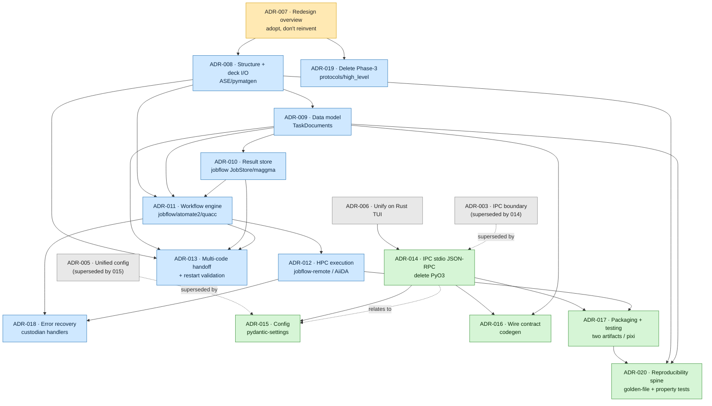

# CrystalMath Redesign — Master Index (ADR-007 … ADR-020)

**Status:** Proposed (the whole set)
**Date:** 2026-06-03
**Governing ADR:** [ADR-007 — Redesign Overview](adr-007-redesign-overview-adopt-ecosystem.md)

This document is the single entry point to the free-rein redesign captured in ADR-007 through
ADR-020. It states the north-star vision, lists every redesign ADR with its status and
supersession, gives a dependency-ordered reading path, and narrates how the pieces fit. The
normative content lives in the ADRs themselves; this index is a map, not a decision.

---

## North-Star Vision

CrystalMath should stop being a half-built clone of the Materials-Project stack and become a thin,
opinionated **conductor** on top of it. The research is unanimous on one point: every subsystem
CrystalMath hand-rolls — a sequential step executor, a bespoke ADAPTIVE error-recovery enum, a flat
job-row SQLite schema, an inline `sbatch` string-builder, two DFT-code abstractions, two JSON-RPC
registries, a fork-by-copy `_vendor` tree — is a worse reimplementation of something the ecosystem
already does robustly: **jobflow/atomate2** for the dynamic DAG, **custodian** for error recovery,
**AiiDA/maggma** for provenance + store, **jobflow-remote/PSI-J/QToolKit** for HPC scheduling,
**pymatgen.io.core + ASE** for input/output, and the **LSP/MCP** JSON-RPC pattern for the UI
boundary.

With **zero current users** and an explicit mandate for bold redesign, the north star is: delete the
homegrown machinery, adopt jobflow as the single workflow IR, persist through one provenance-aware
Store, drive HPC through a pluggable scheduler/transport seam, and let CrystalMath's *actual*
differentiators — the **Rust/Ratatui TUI**, the **multi-code physics knowledge** (especially
CRYSTAL23 and YAMBO, which the ecosystem does **not** cover), and the **one-liner ergonomics** — be
the only code we truly own and maintain.

The result is a system whose every load-bearing component is either (a) a mature,
community-maintained ecosystem tool, or (b) genuinely novel code that only CrystalMath has a reason
to write. Reproducibility is **structural, not aspirational**: provenance is recorded by the engine
on every transition, environments are pinned, inputs are golden-file regression-tested and
content-addressed, and the JSON-RPC protocol is versioned. CrystalMath becomes small, testable, and
FAIR — a TUI and a physics-aware orchestration shim over the best of the materials ecosystem, not a
parallel universe of it.

### The one rule

ADR-007 reduces the whole redesign to a single rule it then sequences:

> **Replace every "N co-equal implementations behind a thin facade, with availability-detection at
> runtime" with *one default* grounded in a mature ecosystem tool — the rest demoted to a genuinely
> optional plugin behind one stable seam, or deleted.**

The audit found that exact shape in seven places: ≥5 runner hierarchies, 3 SLURM-over-SSH stacks, 2
dispatch registries, 2 live transports (PyO3 + IPC), 4 per-code deck seams, 3 result stores, and a
`_vendor/` fork-copy of the deprecated Textual TUI. Each facade *defers* a decision; the cumulative
cost is a `{storage} × {engine} × {transport}` test matrix riddled with `ImportError`-gated silent
no-ops. The redesign makes the decision.

---

## The Canonical Redesign ADR Set

| ADR | Title (short) | Status | Supersedes | Depends on |
|-----|---------------|--------|------------|------------|
| [007](adr-007-redesign-overview-adopt-ecosystem.md) | Redesign overview — adopt the ecosystem, collapse N-way facades to one | Proposed | none | none (governs 008–020) |
| [008](adr-008-structure-and-deck-io-on-ase-pymatgen.md) | Structure + deck I/O on pymatgen + ASE; `CodeDeckGenerator` becomes a thin adapter | Proposed | none | 007 |
| [009](adr-009-canonical-data-model-emmet-pydantic-taskdocs.md) | Canonical result schema — emmet-style versioned pydantic `TaskDocument`s + provenance fields | Proposed | none | 008 |
| [010](adr-010-single-result-store-jobflow-maggma.md) | One canonical result store — jobflow `JobStore` over maggma | Proposed | none | 009 |
| [011](adr-011-workflow-engine-jobflow-atomate2-quacc.md) | Workflow engine — jobflow `Flow`s (atomate2/quacc recipes) as the one orchestration model | Proposed | none | 010, 009, 008 |
| [012](adr-012-hpc-execution-jobflow-remote-aiida-optional.md) | HPC execution — jobflow-remote (outbound-SSH daemon) default, AiiDA opt-in; delete bespoke SLURM/SSH | Proposed | none | 011 |
| [013](adr-013-multi-code-handoff-and-restart-validation.md) | Multi-code handoff — typed document edges + mandatory restart-file validation | Proposed | none | 009, 010, 011, 008 |
| [014](adr-014-ipc-boundary-stdio-jsonrpc-delete-pyo3.md) | Rust↔Python boundary — JSON-RPC over spawned-child stdio (LSP/MCP); delete PyO3, unify dispatch | Proposed | **003** | 006; relates to 015 |
| [015](adr-015-unified-config-pydantic-settings.md) | Unified configuration — pydantic-settings as the single resolver | Proposed | **005** | 014 |
| [016](adr-016-wire-contract-codegen-no-drift.md) | Wire contract — pydantic models as source of truth, generate Rust serde types (no drift) | Proposed | none | 014, 009 |
| [017](adr-017-packaging-testing-two-artifacts-pixi.md) | Packaging & testing — two decoupled artifacts, pixi for HPC, extras-matrix CI | Proposed | none | 014, 012 |
| [018](adr-018-error-recovery-custodian-handlers.md) | Error recovery — custodian-style per-code handlers; delete the bespoke ADAPTIVE recovery | Proposed | none | 011, 012 (relates to 013) |
| [019](adr-019-delete-phase3-protocols-aspiration-layer.md) | Delete the unimplemented `protocols.py`/`high_level` "Phase 3" aspiration layer; keep the type aliases | Proposed | none | 007 (relates to 011) |
| [020](adr-020-reproducibility-and-golden-file-testing.md) | Reproducibility spine — golden-file + property/metamorphic tests, real-DFT parser fixtures (extends 017's testing) | Proposed | none | 008, 009, 017 |

**Supersession relationships to the pre-redesign ADRs (001–006):**

- ADR-007 supersedes nothing; it is the umbrella that *governs* 008–020 and is consistent with the
  ADR-006 direction (single Rust TUI over IPC, Python core as source of truth).
- **ADR-014 supersedes [ADR-003](adr-003-ipc-boundary-design.md)** — it keeps ADR-003's JSON-RPC
  decision but changes the transport from a UDS *listener* to a spawned-child *stdio* stream and
  fixes ADR-003's two named bugs (the `/tmp` socket-path divergence and the auto-start race).
- **ADR-015 supersedes [ADR-005](adr-005-unified-configuration.md)** — it adopts ADR-005's *intent*
  (unified TOML, documented precedence, per-code sections, no hardcoded paths) but replaces its
  hand-rolled dataclass/`tomllib` mechanism with pydantic-settings.
- ADR-006 (unify on Rust TUI) remains **Accepted** and is the *direct upstream* of ADR-014 (it named
  the PyO3→IPC cutover as its keystone follow-up) and the philosophical parent of the whole set.
- [ADR-004](adr-004-editor-lsp-strategy.md) (editor/LSP strategy) is untouched by the redesign.

> The redesign ADRs are all **Proposed**. By house convention the supersession of ADR-003/005 takes
> effect on *acceptance*: their `Status` headers should flip to "Superseded by ADR-014 / ADR-015"
> only when 014/015 are accepted (as ADR-001/002 were flipped to "Superseded by ADR-006"). Until
> then ADR-003 reads "Accepted (Implemented)" and ADR-005 "Proposed" — this is intended, not drift.

---

## Dependency Graph & Reading Order

The set forms an acyclic spine. There are two independently-shippable sub-chains plus the
overview that governs both. Edges point from a prerequisite to the ADR that depends on it; dotted
edges are supersession / "relates-to" annotations, not dependency edges.



The same graph as an ASCII sketch:

```
                        ┌──────────────────────────────────────────────┐
                        │ 007  Redesign Overview (the rule + sequencing)│
                        └───────────────────┬──────────────────────────┘
        SCIENTIFIC SPINE  ◄─────────────────┼─────────────────►  INTEROP / PLATFORM SPINE
                                            │
   008 Structure + deck I/O (pymatgen/ASE)  │            006 Unify on Rust TUI (Accepted)
        │                                   │                 │
   009 Result schema (TaskDocuments) ◄──────┘            014 IPC: stdio JSON-RPC, delete PyO3
        │            (008 feeds the parsers)             (supersedes 003)
   010 Result store (jobflow JobStore/maggma)                 │        ╲
        │                                                     │         ╲ relates to
   011 Workflow engine (jobflow Flows) ──── needs 008,009,010 │     015 Unified config (pydantic-settings)
        │                                                     │         (supersedes 005; depends on 014)
   012 HPC execution (jobflow-remote / AiiDA opt-in)          │
        │                                                016 Wire contract (codegen; needs 014 + 009)
   013 Multi-code handoff (typed edges; needs 008,009,010,011)│
                                                         017 Packaging/testing (needs 014 + 012)
                                                              │
   Cross-cutting hardening:                              020 Reproducibility spine (extends 017; needs 008,009)
   018 Error recovery — custodian handlers (needs 011,012; relates to 013)
   019 Delete Phase-3 protocols/high_level aspiration layer (needs 007; relates to 011)
```

**Recommended reading order:**

1. **[007](adr-007-redesign-overview-adopt-ecosystem.md)** — read first; it is the rule, the
   sequencing, and the deletion triggers. Everything else is an instance of it.
2. **Scientific spine, in order:** **[008](adr-008-structure-and-deck-io-on-ase-pymatgen.md)** →
   **[009](adr-009-canonical-data-model-emmet-pydantic-taskdocs.md)** →
   **[010](adr-010-single-result-store-jobflow-maggma.md)** →
   **[011](adr-011-workflow-engine-jobflow-atomate2-quacc.md)** →
   **[012](adr-012-hpc-execution-jobflow-remote-aiida-optional.md)** →
   **[013](adr-013-multi-code-handoff-and-restart-validation.md)**. This is a true dependency chain:
   the I/O seam (008) populates the schema (009), which the store (010) persists, which the engine
   (011) writes into, which the HPC layer (012) runs, with the multi-code handoff (013) layering
   typed, validated edges on top of all of them.
3. **Interop/platform spine, in order:** **[014](adr-014-ipc-boundary-stdio-jsonrpc-delete-pyo3.md)**
   → **[015](adr-015-unified-config-pydantic-settings.md)** →
   **[016](adr-016-wire-contract-codegen-no-drift.md)** →
   **[017](adr-017-packaging-testing-two-artifacts-pixi.md)**. The PyO3→IPC cutover (014) is the
   keystone; config (015) and the codegen contract (016) ride on the unified boundary; packaging
   (017) is unblocked only once PyO3 is gone (014) and the heavy-dependency footprint is bounded
   (012).
4. **Cross-cutting hardening:** **[018](adr-018-error-recovery-custodian-handlers.md)** error
   recovery (after 011/012), **[019](adr-019-delete-phase3-protocols-aspiration-layer.md)** delete
   the aspiration layer (after 007), **[020](adr-020-reproducibility-and-golden-file-testing.md)**
   reproducibility/golden-file testing (after 017). These deepen and harden the two spines rather
   than extending them: 018 swaps the bespoke ADAPTIVE recovery for custodian handlers beneath the
   engine, 019 deletes the dead `protocols.py`/`high_level` "Phase 3" layer, and 020 is the
   golden-file/property-testing reproducibility spine that 017's testing section references.

**Note on 014 ↔ 015.** These two genuinely co-need each other (the IPC boundary needs config to
resolve the server invocation; config exposes itself over the IPC dispatch table via `config.get`).
The cycle is broken in the headers by making **014 depend on ADR-006** and only *relate to* 015,
while **015 depends on 014** — so the acyclic reading order is 014 → 015.

---

## How the Pieces Fit (the narrative)

A **workflow** is a jobflow `Flow` of typed jobs (ADR-011). Each job is produced by a per-code seam:
for VASP and the common pymatgen/ASE workflows it delegates to an atomate2/quacc recipe; for
CRYSTAL23 and YAMBO — which the ecosystem does **not** cover — CrystalMath wraps its own
`CodeDeckGenerator`/`InputDeck` seam (ADR-008), now rebuilt as a thin adapter over
`pymatgen.io` `InputSet`s and ASE `FileIO`/`Socket` calculators instead of hand-rolled
POSCAR/d12/pw.in writers. One structure object (`pymatgen.Structure` ⇄ ASE `Atoms`) flows
everywhere.

Every job emits a **typed, versioned `TaskDocument`** (ADR-009, one emmet-style pydantic subclass
per code), replacing the untyped `key_results` blob and the six competing `JobState` enums with one
schema and one state type, validated on write. Each document carries **first-class provenance fields**
(input hash, code + version, structure uuid, parent-job uuids, content-addressed raw-file paths) so
that even the lightweight default path is reproducible — AiiDA's input/create-link guarantee captured
as plain document fields rather than as a mandatory graph database.

Those documents land in **one canonical store** (ADR-010): a jobflow `JobStore` over maggma —
serverless `MontyStore`/`JSONStore` by default for the laptop/TUI case, a one-config-key swap to
`MongoStore` + `S3Store`/`GridFS` for shared/HPC. This deletes the bespoke SQLite schema, the
984-LOC `jobflow_store.py` bridge, and the three-way storage split.

The `Flow` is submitted through **one pluggable execution seam** (ADR-012): the `ExecutionBackend`
protocol with exactly two implementations — **jobflow-remote**, an outbound-SSH polling daemon that
matches firewalled-HPC reality and runs *all* compute via `sbatch` by construction (the default);
and **AiiDA**, the single opt-in heavyweight backend for publication-grade provenance, never imposing
its PostgreSQL/RabbitMQ tax on the default user. SLURM/SSH is thereby demoted from three hand-rolled
runner stacks to one maintained, schema-driven submitter beneath the engine. Parsl/Dask are reserved
strictly as *in-allocation* executors, never the SSH boundary.

The reason CrystalMath exists — **chaining different quantum engines** (VASP→YAMBO, CRYSTAL `.f9`
GUESSP restarts, →phonopy force sets) — becomes a **typed, validated edge between TaskDocuments**
(ADR-013): a `CodeHandoff` named by the *physical quantity* that crosses (wavefunction, charge
density, structure, force set), with **mandatory, positive** restart-file validation (positive file
matching, checksum + source-completion provenance match, parallelization consistency) that fails
*before* a doomed job is submitted — closing the single most consequential silent-wrong-result bug
class for a multi-code manager, on the default path, not just under AiiDA.

On the **interop boundary**, the keystone finally lands (ADR-014): flip the Cargo default off
`pyo3-bridge`, make Content-Length-framed JSON-RPC over a spawned-child stdio stream the single live
transport (the materials-science analogue of an editor talking to a language server), delete
`src/bridge.rs`'s PyO3 internals, the `pyo3-bridge` feature, the ~40 typed `request_*` helpers, and
the `PYO3_PYTHON` build dance. The two Python JSON-RPC registries collapse into one `domain.verb`
table (killing the `jobs.list` shadowing bug and the init-error-masked-as-"Method not found" bug).
The serde↔pydantic contract is then made **drift-proof by codegen** (ADR-016): pydantic models are
the source of truth, JSON Schema is exported from them, and the Rust serde types are *generated* in
`build.rs` — so a field rename breaks `cargo build` at CI time, not a TUI tab at runtime.
**Configuration** (ADR-015) collapses to one pydantic-settings resolver in the Python core; the Rust
TUI and the Bash CLI read *resolved* values (via the stdio handshake / `config.get` / a
`--export-bash` shim) and never parse TOML independently — structurally ending the socket-path
mismatch.

Finally, with PyO3 gone, the build **decouples into two artifacts** (ADR-017): a standalone Rust
binary (cargo-dist + Homebrew + conda-forge) and a pure-Python wheel (hatchling + PyPI trusted
publishing), with a versioned IPC handshake guarding against skew, **pixi** providing
bit-reproducible conda-forge environments for the heavy/HPC stack, and a CI **extras matrix** +
**synthetic-POTCAR fixtures** turning silently-skipped optional seams into actually-tested ones. The
deprecated Textual `tui/` and the `_vendor/` fork are deleted wholesale once nothing imports them.

Three cross-cutting ADRs harden this spine. **Per-code error recovery** (ADR-018) deletes the
bespoke `ErrorRecoveryStrategy` ADAPTIVE machinery — the substring-grep `_is_retryable_error` and the
blind `step.parameters` multiplier — and replaces it with custodian's wrap–detect–patch–restart loop
beneath the engine: the maintained `VaspErrorHandler`/QE catalogue for ecosystem codes, thin
CRYSTAL23/YAMBO `ErrorHandler` subclasses for the codes we own, with graph-level recovery left to
jobflow `Response` and single-job restart edges validated by ADR-013. The **`protocols.py`/`high_level`
"Phase 3" aspiration layer** (ADR-019) — a never-implemented `WorkflowRunner`/`StructureProvider`/
`ParameterGenerator`/… `Protocol` surface whose factories only `raise NotImplementedError` — is deleted
outright (keeping just the load-bearing `WorkflowType`/`DFTCode`/`ResourceRequirements` aliases), so the
`decks/` seam and the jobflow engine are the *single* answer to "how do I run a workflow?" Finally, the
**reproducibility spine** (ADR-020) makes the whole rewrite defensible: golden-file deck regression
(`pytest-regressions` full-file diffs), Hypothesis property + metamorphic/symmetry invariants, and real
canned-DFT parser fixtures (no DFT in CI) — the deeper testing spine that ADR-017's testing section
references, turning "did this change the physics?" into a CI-answered question.

The net effect is large-scale **deletion plus delegation**: ~3.3k LOC of bespoke SLURM/SSH, the
984-LOC jobflow bridge, the 1,185-LOC PyO3 bridge, the `_vendor/` fork (33 files), the deprecated
`tui/` package, the bespoke ADAPTIVE recovery, and the `protocols.py`/`high_level` "Phase 3" layer all
go, leaving CrystalMath as a small, testable, FAIR shim over the best of the materials ecosystem.

---

## Migration Sequencing (deletion is trigger-gated)

ADR-007 defines the order and the testable trigger for each deletion (nothing is deleted on faith).
In dependency terms:

1. **014** — flip transport default to stdio JSON-RPC + unify dispatch → deletes PyO3 internals, the
   `pyo3-bridge` feature, the `request_*` sprawl, the `PYO3_PYTHON` dance. *(Independently shippable;
   the single highest-leverage move.)*
2. **009 + 010** — stand up `TaskDocument` + `JobStore` as the canonical schema/store → deletes the
   bespoke SQLite schema, the `jobflow_store.py` bridge, the duplicate state enums.
3. **008** — make `CodeDeckGenerator` the only per-code seam over ASE/pymatgen → deletes
   `vasp/generator.py`, `_vendor/core/codes/`, `quacc/potcar.py`.
4. **011 + 012** — adopt jobflow Flows + jobflow-remote/AiiDA behind one `ExecutionBackend` → deletes
   `high_level/runners.py`, `_vendor/runners/`, `integrations/slurm_runner.py`,
   `_vendor/core/connection_manager.py`, the stub-execution scaffolding.
5. **(011–012 outcome)** — once nothing imports `_vendor/`, **`tui/` and `_vendor/` are deleted
   together**.
6. **016 + 017** — codegen the wire contract; decouple packaging into two artifacts once PyO3 is gone
   and the core is pure-Python.

Steps 1–3 are independently shippable; 4–6 depend on them. No data migration is needed (zero users):
every store/transport swap is a cutover, not a dual-write.

---

## Provenance of this Index

- Canonical ADRs: `adr-007` … `adr-020` in this directory (all dated 2026-06-03, all **Proposed**).
- Upstream (pre-redesign) ADRs referenced: [003](adr-003-ipc-boundary-design.md),
  [004](adr-004-editor-lsp-strategy.md), [005](adr-005-unified-configuration.md),
  [006](adr-006-unify-on-rust-tui.md).
