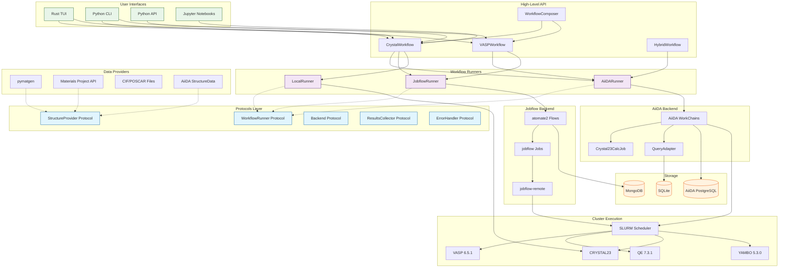
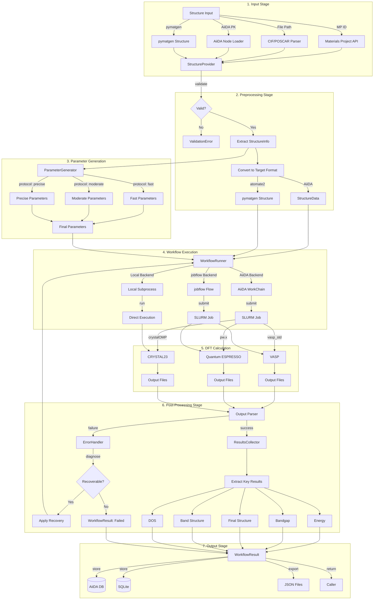
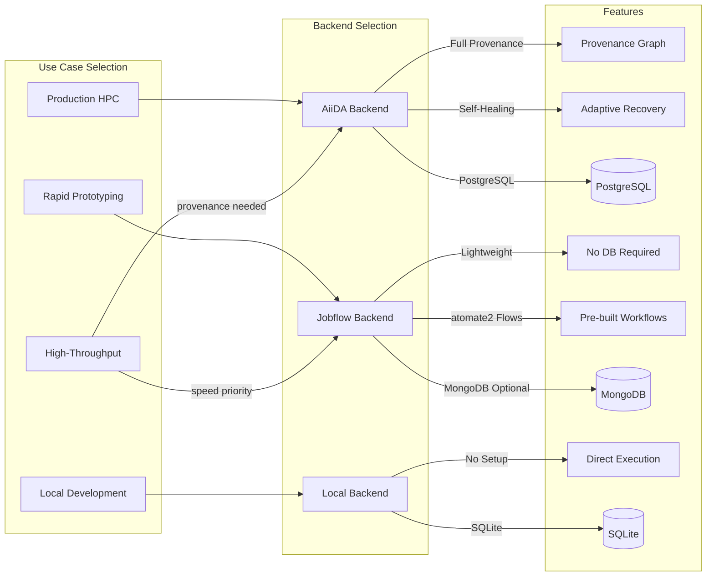
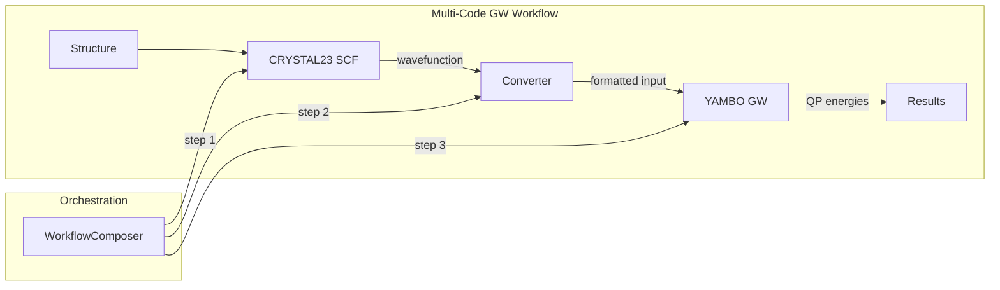

# Unified Workflow Architecture

**Version:** 2.0.0
**Status:** Design Phase
**Date:** 2026-01-09
**Phase:** 2.1 of CrystalMath Workflow Integration Project

---

## Executive Summary

This document defines the unified workflow architecture for CrystalMath, integrating:

1. **CrystalController API** - Existing job management interface (backward compatible)
2. **AiiDA WorkChains** - Robust job management with full provenance
3. **atomate2 Flows** - Pre-built materials science workflows via jobflow
4. **pymatgen** - Structure manipulation and analysis foundation

The architecture resolves the friction point of having two separate AiiDA integrations (`tui/src/aiida/` and `python/crystalmath/backends/`) by introducing a unified Protocol-based interface layer that both can implement.

---

## Table of Contents

1. [Architecture Overview](#architecture-overview)
2. [Component Diagram](#component-diagram)
3. [Interface Definitions](#interface-definitions)
4. [Data Flow](#data-flow)
5. [Backend Abstraction](#backend-abstraction)
6. [Workflow Composition](#workflow-composition)
7. [Migration Strategy](#migration-strategy)
8. [Implementation Phases](#implementation-phases)

---

## Architecture Overview

### Design Principles

1. **Backend Agnostic** - Workflows defined once, run anywhere (AiiDA, jobflow, local)
2. **Protocol-First** - Python Protocols define contracts, implementations vary
3. **Composable** - Simple workflows chain into complex pipelines
4. **Self-Healing** - Adaptive error recovery built into the architecture
5. **Backward Compatible** - Existing CrystalController API preserved

### Layer Architecture

```
+========================================================================+
|                         User Interface Layer                            |
|  +------------------+  +------------------+  +----------------------+   |
|  |   Rust TUI       |  |   Python CLI     |  |   Jupyter/Scripts    |   |
|  +------------------+  +------------------+  +----------------------+   |
+========================================================================+
                                    |
                                    v
+========================================================================+
|                       High-Level Workflow API                           |
|  +------------------------------------------------------------------+  |
|  |  CrystalWorkflow  |  VASPWorkflow  |  HybridWorkflow  |  etc.    |  |
|  +------------------------------------------------------------------+  |
|  |  - One-liner methods: relax(), bands(), dos(), gw(), bse()       |  |
|  |  - Protocol-based (auto-select best backend)                     |  |
|  |  - Composable via WorkflowComposer                               |  |
|  +------------------------------------------------------------------+  |
+========================================================================+
                                    |
                                    v
+========================================================================+
|                      Workflow Runner Layer                              |
|  +------------------+  +------------------+  +------------------+       |
|  |   AiiDARunner    |  |  JobflowRunner   |  |   LocalRunner    |       |
|  | (Full Provenance)|  | (Rapid Prototype)|  | (Development)    |       |
|  +------------------+  +------------------+  +------------------+       |
|           |                    |                    |                   |
|           v                    v                    v                   |
|  +------------------+  +------------------+  +------------------+       |
|  | AiiDA WorkChains |  | atomate2 Flows   |  | Direct Execution |       |
|  | (tui/src/aiida/) |  | (jobflow engine) |  | (subprocess)     |       |
|  +------------------+  +------------------+  +------------------+       |
+========================================================================+
                                    |
                                    v
+========================================================================+
|                       Protocol Interface Layer                          |
|  +------------------------------------------------------------------+  |
|  |  WorkflowRunner  |  StructureProvider  |  Backend  |  ErrorHandler |
|  +------------------------------------------------------------------+  |
|  |  (Defined in python/crystalmath/protocols.py)                    |  |
|  +------------------------------------------------------------------+  |
+========================================================================+
                                    |
                                    v
+========================================================================+
|                         Data/Storage Layer                              |
|  +------------------+  +------------------+  +------------------+       |
|  |   AiiDA ORM      |  |   SQLite DB      |  |  MongoDB/Maggma  |       |
|  |  (PostgreSQL)    |  | (.crystal_tui.db)|  |  (atomate2)      |       |
|  +------------------+  +------------------+  +------------------+       |
+========================================================================+
```

---

## Component Diagram



---

## Interface Definitions

### Core Protocols

The unified architecture defines these key Protocol interfaces in `python/crystalmath/protocols.py`:

#### 1. WorkflowRunner Protocol

The central interface for workflow execution:

```python
@runtime_checkable
class WorkflowRunner(Protocol):
    """Execute workflows on any backend."""

    @property
    def name(self) -> str: ...

    @property
    def is_available(self) -> bool: ...

    def submit(
        self,
        workflow_type: WorkflowType,
        structure: Any,
        parameters: Dict[str, Any],
        code: DFTCode,
        resources: Optional[ResourceRequirements] = None,
        **kwargs: Any,
    ) -> WorkflowResult: ...

    def submit_composite(
        self,
        steps: Sequence[WorkflowStep],
        structure: Any,
        **kwargs: Any,
    ) -> WorkflowResult: ...

    def get_status(self, workflow_id: str) -> WorkflowState: ...
    def get_result(self, workflow_id: str) -> WorkflowResult: ...
    def cancel(self, workflow_id: str) -> bool: ...
```

#### 2. StructureProvider Protocol

Unified structure access from any source:

```python
@runtime_checkable
class StructureProvider(Protocol):
    """Provide structures from various sources."""

    def get_structure(self, identifier: str) -> Any: ...
    def to_aiida_structure(self, structure: Any) -> Any: ...
    def to_pymatgen_structure(self, structure: Any) -> Any: ...
    def get_info(self, structure: Any) -> StructureInfo: ...
    def validate(self, structure: Any) -> tuple[bool, List[str]]: ...
```

#### 3. Backend Protocol (Existing)

Preserves existing CrystalController compatibility:

```python
@runtime_checkable
class Backend(Protocol):
    """Job storage and execution backend."""

    @property
    def name(self) -> str: ...

    @property
    def is_available(self) -> bool: ...

    def get_jobs(self, limit: int = 100) -> List[JobStatus]: ...
    def get_job_details(self, pk: int) -> Optional[JobDetails]: ...
    def submit_job(self, submission: JobSubmission) -> int: ...
    def cancel_job(self, pk: int) -> bool: ...
    def get_job_log(self, pk: int, tail_lines: int = 100) -> Dict[str, List[str]]: ...
```

#### 4. Additional Protocols

- **ResultsCollector**: Extract and aggregate workflow outputs
- **ParameterGenerator**: Generate DFT parameters for different codes
- **ErrorHandler**: Diagnose failures and apply recovery strategies
- **WorkflowComposer**: Build complex multi-step workflows declaratively

---

## Data Flow

### Complete Workflow Pipeline



### Detailed Data Transformations

| Stage | Input | Transformation | Output |
|-------|-------|----------------|--------|
| 1. Input | MP ID / File / PK | StructureProvider.get_structure() | Raw structure object |
| 2. Validation | Raw structure | StructureProvider.validate() | Validated structure + StructureInfo |
| 3. Conversion | Any format | to_aiida_structure() / to_pymatgen_structure() | Target format structure |
| 4. Parameters | StructureInfo | ParameterGenerator.generate() | Complete parameter dict |
| 5. Submission | Structure + Params | WorkflowRunner.submit() | WorkflowResult (pending) |
| 6. Execution | Job submission | SLURM/direct execution | DFT output files |
| 7. Parsing | Output files | Code-specific parser | Parsed results dict |
| 8. Collection | Parsed results | ResultsCollector.collect() | Standardized WorkflowResult |

---

## Backend Abstraction

### Dual-Backend Strategy

The architecture supports two primary backends, selected based on use case:



### AiiDA Backend Implementation

The AiiDA backend unifies the existing code locations:

```
CURRENT STATE (Friction Point):
  tui/src/aiida/           <- 29 files, WorkChains, CalcJobs
  python/crystalmath/backends/aiida.py <- Simple Backend implementation

UNIFIED APPROACH:
  python/crystalmath/
    runners/
      aiida_runner.py      <- Implements WorkflowRunner protocol
                              Delegates to tui/src/aiida/ WorkChains
    backends/
      aiida.py             <- Implements Backend protocol (unchanged)
```

The `AiiDARunner` becomes a thin wrapper that:
1. Implements the `WorkflowRunner` protocol
2. Delegates to existing WorkChains in `tui/src/aiida/workchains/`
3. Uses the existing `AiiDABackend` for job storage operations

### Jobflow Backend Implementation

New implementation for atomate2 integration:

```python
# python/crystalmath/runners/jobflow_runner.py

from crystalmath.protocols import WorkflowRunner, WorkflowResult

class JobflowRunner(WorkflowRunner):
    """WorkflowRunner implementation using jobflow/atomate2."""

    def __init__(self, store: Optional[JobStore] = None):
        self._store = store or MemoryStore()
        self._manager: Optional[JobManager] = None

    def submit(self, workflow_type, structure, parameters, code, **kwargs):
        # Map to atomate2 Maker
        maker = self._get_maker(workflow_type, code)

        # Create Flow
        flow = maker.make(structure, **parameters)

        # Submit via jobflow-remote or run locally
        if self._manager:
            responses = self._manager.run(flow)
        else:
            responses = run_locally(flow, store=self._store)

        return self._to_workflow_result(responses)
```

---

## Workflow Composition

### Declarative Workflow Definition

The `WorkflowComposer` enables building complex workflows:

```python
from crystalmath.protocols import WorkflowComposer, WorkflowType

# Build a relax -> bands -> dos workflow
workflow = (
    WorkflowComposer()
    .add_step("relax", WorkflowType.RELAX, code="vasp")
    .add_step("scf", WorkflowType.SCF, code="crystal23", depends_on=["relax"])
    .add_step("bands", WorkflowType.BANDS, code="crystal23", depends_on=["scf"])
    .add_step("dos", WorkflowType.DOS, code="crystal23", depends_on=["scf"])
    .build()
)

# Execute on any backend
runner = get_runner("aiida")  # or "jobflow" or "local"
result = runner.submit_composite(workflow, structure)
```

### Multi-Code Workflow Pattern

For workflows spanning multiple DFT codes (e.g., CRYSTAL -> YAMBO for GW):



### Pre-Built Workflow Templates

Common workflows are provided as ready-to-use templates:

| Template | Steps | Primary Code | Description |
|----------|-------|--------------|-------------|
| `RelaxBandsTemplate` | relax -> bands | CRYSTAL23/VASP | Structure optimization + band structure |
| `ConvergenceTemplate` | param sweep | Any | K-point/cutoff convergence study |
| `GWTemplate` | SCF -> GW | CRYSTAL23 + YAMBO | Quasiparticle corrections |
| `BSETemplate` | SCF -> GW -> BSE | CRYSTAL23 + YAMBO | Exciton calculations |
| `ElasticTemplate` | strain sweep | VASP | Elastic constants |
| `PhononTemplate` | supercell -> forces | Any + Phonopy | Phonon dispersion |

---

## Migration Strategy

### Resolving the Dual AiiDA Integration

**Problem:** Two separate AiiDA integrations exist:
1. `tui/src/aiida/` - Comprehensive (29 files), WorkChains, CalcJobs
2. `python/crystalmath/backends/aiida.py` - Simple Backend implementation

**Solution:** Protocol-based unification without moving files:

```
Phase 1: Define Protocols (This Document)
  - Create python/crystalmath/protocols.py
  - Define WorkflowRunner, StructureProvider, etc.

Phase 2: Create AiiDARunner Wrapper
  - New file: python/crystalmath/runners/aiida_runner.py
  - Implements WorkflowRunner protocol
  - Delegates to tui/src/aiida/ WorkChains
  - Does NOT duplicate functionality

Phase 3: Adapt Existing Code
  - tui/src/aiida/workchains/ unchanged (they work)
  - python/crystalmath/backends/aiida.py unchanged (backward compat)
  - New high-level API uses AiiDARunner

Phase 4: Add Jobflow Backend
  - New file: python/crystalmath/runners/jobflow_runner.py
  - Enables atomate2 integration
  - Optional dependency
```

### Backward Compatibility

The existing CrystalController API remains unchanged:

```python
# This continues to work exactly as before
from crystalmath.api import CrystalController

controller = CrystalController(use_aiida=True)
jobs = controller.get_jobs()
controller.submit_job(submission)
```

New high-level API is additive:

```python
# New workflow API (optional, additive)
from crystalmath.workflows import CrystalWorkflow

workflow = CrystalWorkflow(backend="aiida")
result = workflow.relax_bands(structure, protocol="moderate")
```

---

## Implementation Phases

### Phase 2.1: Architecture Design (Current)
- [x] Define protocol interfaces in `protocols.py`
- [x] Create architecture documentation with Mermaid diagrams
- [x] Document data flow and transformation pipeline
- [ ] Review and approval

### Phase 2.2: atomate2 Integration Design
- [ ] Design atomate2 Maker wrappers for CRYSTAL23
- [ ] Define jobflow integration patterns
- [ ] Create adapter classes for atomate2 ↔ crystalmath

### Phase 2.3: High-Level API Design
- [ ] Design CrystalWorkflow class
- [ ] Create one-liner methods (relax, bands, dos, etc.)
- [ ] Implement WorkflowComposer

### Phase 3: Implementation
- [ ] Implement AiiDARunner wrapper
- [ ] Implement JobflowRunner
- [ ] Implement LocalRunner
- [ ] Create structure providers
- [ ] Create parameter generators

### Phase 4: Testing and Validation
- [ ] Unit tests for protocols
- [ ] Integration tests with beefcake2 cluster
- [ ] Performance benchmarking
- [ ] Documentation

---

## Appendix: Protocol File Location

The complete protocol definitions are in:

```
python/crystalmath/protocols.py
```

Key exports:
- `WorkflowRunner` - Execute workflows on any backend
- `StructureProvider` - Unified structure access
- `Backend` - Job storage interface (existing)
- `ResultsCollector` - Result aggregation
- `ParameterGenerator` - DFT parameter generation
- `ErrorHandler` - Failure recovery
- `WorkflowComposer` - Multi-step workflow builder
- `WorkflowResult` - Standardized result container
- `ResourceRequirements` - Computational resource spec

Factory functions:
- `get_runner(backend_type)` - Get appropriate runner
- `get_structure_provider(source)` - Get structure provider
- `get_parameter_generator(code)` - Get parameter generator

---

## References

1. AiiDA 2.x Documentation: https://aiida.readthedocs.io/
2. atomate2 Documentation: https://materialsproject.github.io/atomate2/
3. jobflow Documentation: https://materialsproject.github.io/jobflow/
4. pymatgen Documentation: https://pymatgen.org/
5. CrystalMath Phase 1 Research: `.beads/` issues crystalmath-m1v5, crystalmath-dddy, crystalmath-n3fy
